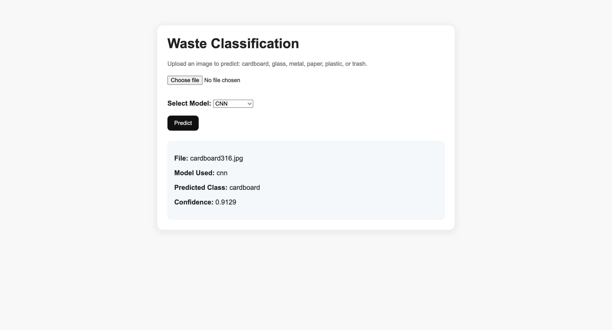
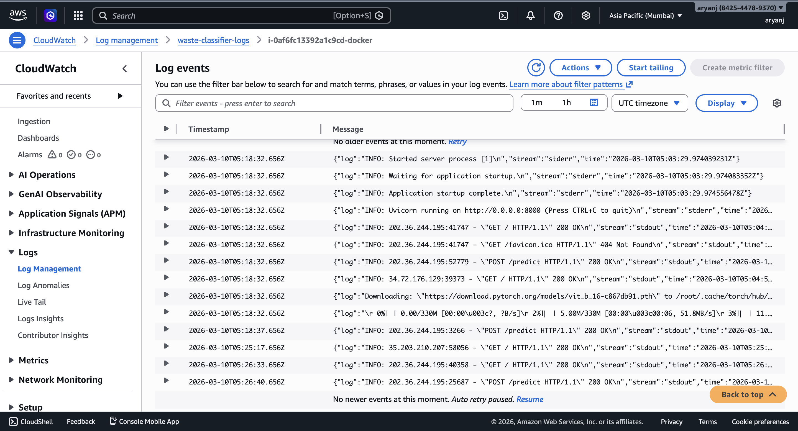
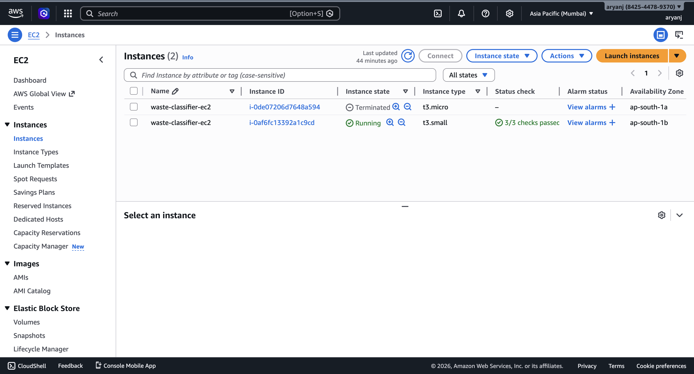

# Waste Classification: CNN vs Transformer

A production-style computer vision project that compares a custom **Convolutional Neural Network (CNN)** with a pretrained **Vision Transformer (ViT)** for **6-class waste image classification**.

The project includes:

* end-to-end model training and evaluation in **PyTorch**
* a side-by-side **CNN vs Transformer** comparison
* performance improvements through **stratified splitting, data augmentation, learning-rate scheduling, and early stopping**
* a simple **FastAPI** inference app with model selection
* containerization with **Docker**
* deployment on **AWS EC2**
* **CloudWatch** monitoring and centralized log collection

---

## Problem Statement

Waste sorting is an important real-world computer vision task. The goal of this project is to classify an uploaded image into one of the following categories:

* cardboard
* glass
* metal
* paper
* plastic
* trash

This project was designed to answer two questions:

1. How does a lightweight custom CNN compare against a pretrained Vision Transformer on a small, imbalanced image dataset?
2. How much can classical training improvements help the CNN pipeline?

---

## Demo

### App UI

### CloudWatch Logs

### AWS EC2 Deployment

---

## Models Compared

### 1. Custom CNN

A 4-block convolutional neural network built from scratch in PyTorch.

### 2. Pretrained Vision Transformer

A pretrained **ViT-B/16** model adapted for 6-class classification, with the classification head fine-tuned for this task.

---

## Dataset
https://www.kaggle.com/datasets/asdasdasasdas/garbage-classification 

This project uses a **6-class garbage/waste classification dataset** with the following labels:

* cardboard
* glass
* metal
* paper
* plastic
* trash

The dataset is imbalanced, especially for the `trash` class, which makes this a good real-world small-data classification problem.

---

## Training Pipeline

### Baseline Phase

* random train/validation/test split
* standard resizing and normalization
* baseline CNN training
* baseline transformer training

### Improved Phase

* stratified train/validation/test split
* train-time augmentation:

  * random horizontal flip
  * random rotation
  * color jitter
* learning-rate scheduling
* early stopping

---

## Results

| Model              | Setup    | Validation Accuracy | Test Accuracy |
| ------------------ | -------- | ------------------: | ------------: |
| Custom CNN         | Baseline |               69.9% |         68.7% |
| Custom CNN         | Improved |               72.3% |         74.2% |
| Vision Transformer | Baseline |               88.7% |         91.8% |
| Vision Transformer | Improved |               92.4% |         89.7% |

### Key Takeaways

* The **custom CNN** benefited significantly from data-centric and training-loop improvements.
* The **pretrained Vision Transformer** was the strongest overall model on the test set.
* The improved transformer achieved higher validation accuracy, but the baseline transformer remained the best final test performer.

---

## Tech Stack

**Modeling / Training**

* Python
* PyTorch
* Torchvision
* Scikit-learn

**Backend / Inference**

* FastAPI
* Jinja2
* Pillow

**Deployment / Infra**

* Docker
* AWS EC2
* Amazon CloudWatch

---

## How the App Works

The deployed web app allows a user to:

1. upload an image
2. choose either **CNN** or **Transformer**
3. run inference
4. view:

   * predicted class
   * confidence score
   * selected model

---

## Monitoring and Logging

The EC2-hosted Dockerized FastAPI service was monitored using **Amazon CloudWatch**.

### Monitoring

* EC2 instance metrics were visible through **CloudWatch / EC2 monitoring**.

### Logging

* Docker/container logs were collected and shipped to **CloudWatch Logs** using the **CloudWatch Agent**.
* This made it possible to observe:

  * startup logs
  * `GET /` requests
  * `POST /predict` requests
  * runtime errors / tracebacks

---

## Future Improvements

* add per-class precision / recall / confusion matrix to the UI
* support top-k predictions
* use a lighter production transformer backbone
* add CI/CD for automated deployment
* migrate from raw EC2 to a more managed serving workflow
* add custom application-level logging for model name, prediction, and latency
